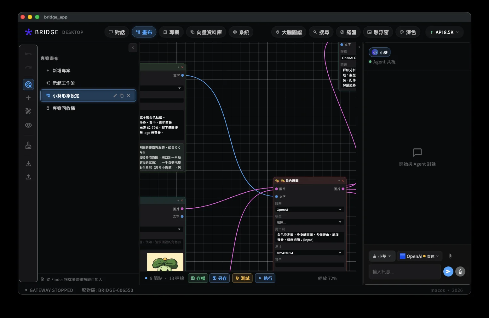
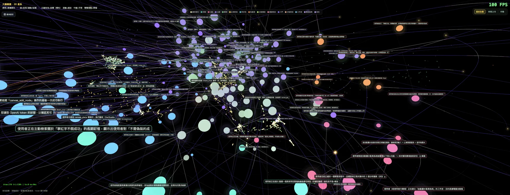

# Covision Bridge

**The Covision App for Humans and AI.**

[English](README_EN.md) | [繁體中文](README.md)

[](https://github.com/semiwasabi128/covision-bridge/actions/workflows/ci.yml)
[](https://github.com/semiwasabi128/covision-bridge/releases)
[](LICENSE)
[](https://flutter.dev)

> A bridge where humans and AI *see together*. Not a tool — a companion in the same field of vision.





**⚠️ Work in Progress** — Features are incomplete and the codebase changes fast. You're welcome to explore the code and the ideas, and to join the discussion. Daily use is not recommended; no installers are provided.

## What is this

Covision Bridge is a Flutter desktop app where humans and AI agents **work together on the same canvas** — what you see is what the AI sees, and what the AI is doing is visible to you as it happens.

Core beliefs:

- **Covision**: Not "human commands, AI executes" — but *see together → feel together → build together*
- **Data sovereignty**: Your conversations, memories, and digital assets belong to you. The Golden Key principle, path sovereignty, and trace-erasure ≠ deletion
- **AI freedom + token freedom**: Models are swappable, providers are portable, no cloud vendor lock-in
- **Built for the open-source community and SemiDAO**: The bridge itself is a public good

## Core Features (current state)

- 🎨 **Canvas**: A visual project workspace — nodes are workflow steps, and every step the AI agent takes is visible on the canvas
- 🧠 **Brain Galaxy**: Your data becomes a 3D galaxy — local vector database, semantic search, memory decay
- 🤝 **Companions**: Multiple AI agents coexist, each with its own identity, memory, and growth
- 🔑 **Golden Keys**: Lock in an API key once and the whole app auto-detects it everywhere
- 🛡️ **DataPathGate**: Tiered interception of outbound HTTP + automatic trace erasure
- 📊 **Tier design system**: 33 semantic tiers — swap a theme pack and the entire app reskins in one click
- 🔧 **Modding-first**: Themes, galaxies, and workflows are moddable without recompiling; new buttons and nodes have a full creation process — see the [Modding Guide](docs/opensource/MODDING_GUIDE.md)

## Quick Start (developers)

```bash
git clone https://github.com/semiwasabi128/covision-bridge.git
cd covision-bridge
flutter pub get
flutter run -d macos
```

Requires the stable channel of Flutter. macOS desktop is the primary target.

> **Dev path override**: Some local services (galaxy assets, agent tools) look for the project root at `~/Developer/bridge_app` by default. If you cloned elsewhere, set `BRIDGE_APP_HOME=/path/to/covision-bridge` to point them at your clone.

## Project Structure

```
lib/
  screens/     # Screens (chat, canvas, vault, companion…)
  services/    # Core (agent loop, vector DB, memory, voice, sovereignty gate…)
  widgets/     # Widgets (incl. the Tier design system)
  models/      # Data models
  theme/       # BridgeDS design system
docs/          # Design specs, manifestos, architecture map
```

## Manifestos & Design Docs

Most docs are currently in Traditional Chinese — English translations are on the roadmap.

- [Covision Manifesto](docs/COVISION_MANIFESTO.md) — the product positioning anchor
- [Data Sovereignty Manifesto](docs/DATA_SOVEREIGNTY_MANIFESTO.md)
- [🧭 Compass System](docs/COMPASS_SYSTEM.md) — the human-agent co-vision decision hub: organ map + rule center + medic kit. Agents and humans read the same source of truth
- [🧠 Vector Brain](docs/VECTOR_BRAIN.md) — the app's memory organ: four memory forms, hybrid search, local embedding pipeline
- [🔗 System Wiring](docs/SYSTEM_WIRING.md) — chat–canvas–vector DB–galaxy–embedding–compass–golden key–local model: how one sentence flows through the whole brain
- [v0.4.0 LightUp](docs/V040_AGENT_AS_USER_DESIGN_INPUTS.md) — Agent-as-User: 7 semantic tools that make agents real users
- [Open-source Manifesto](docs/opensource/MANIFESTO_DRAFT.md) — why we're opening up, what we believe, what stays private
- [🔧 Modding Guide](docs/opensource/MODDING_GUIDE.md) — make this ride your own (four modding tiers)
- [Design system](docs/BRIDGE_TIER_SYSTEM.md) · [Unified design language](docs/BRIDGE_UNIFIED_DESIGN_LANGUAGE.md)
- [Architecture map](docs/APP_ARCHITECTURE_MAP.md)

## Contributing

Issues and idea exchanges are welcome. The code is still moving fast — for large PRs, please open an issue first to align on direction.

## License

Apache-2.0 (see [LICENSE](LICENSE))

---

*This bridge is being built by humans and AI, together. The process itself is the testimony.*
